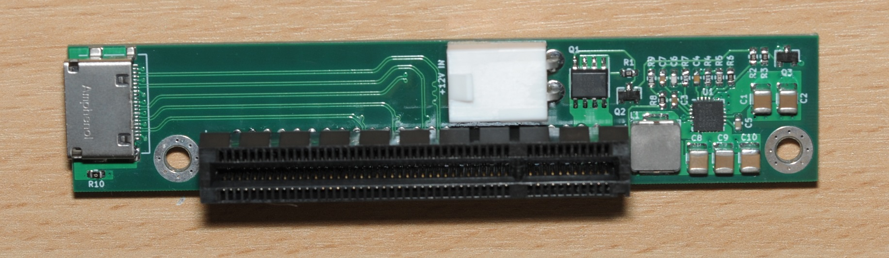

# OCuLink to PCIe x4 Adapter

#### Description

This repository contains the design files for a PCIe x4 (x8 physical) to OCuLink adapter I designed to solve some difficult PC build problems some time ago.

It is strictly PCIe Gen 3 or less only.